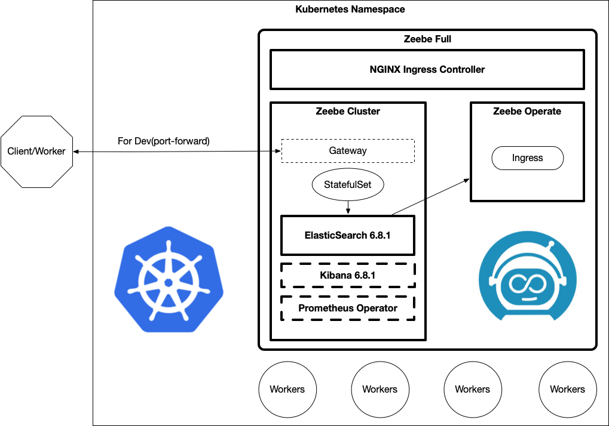

[](https://github.com/camunda-community-hub/community)[](https://github.com/Camunda-Community-Hub/community/blob/main/extension-lifecycle.md#incubating-)

# Zeebe Kubernetes HELM Charts


This repository host Zeebe HELM charts for Kubernetes, this charts can be accessed by adding the following HELM repo to your HELM setup:
```
> helm repo add zeebe https://helm.camunda.io
> helm repo update
```
There are three main charts which are represented in the following image:


**Note check the [Zeebe Helm Profiles](https://github.com/zeebe-io/zeebe-helm-profiles) repository for different configurations for your clusters, such as Dev, HA, etc. Feel free to contribute with your own profiles if you want to**

You can consume each individual chart, or use the `zeebe-full-helm` chart which will install all the components, including an NGINX Ingress Controller.

Currently hosting the following charts:
- [zeebe-cluster-helm](http://github.com/zeebe-io/zeebe-cluster-helm)
  - Depends on: [ElasticSearch](https://github.com/elastic/helm-charts/tree/master/elasticsearch), [Kibana](https://github.com/elastic/helm-charts/tree/master/kibana), [Prometheus Operator](https://github.com/helm/charts/tree/master/stable/prometheus-operator)
- [zeebe-operate-helm](http://github.com/zeebe-io/zeebe-operate-helm)
  - Can be configured to point to a Zeebe Cluster
- [zeebe-full-helm](http://github.com/zeebe-io/zeebe-full-helm)
  - Depends on: zeebe-cluster, zeebe-operate and [nginx-ingress](https://github.com/helm/charts/tree/master/stable/nginx-ingress)
- [zeebe-tasklist-helm](http://github.com/zeebe-io/zeebe-tasklist-helm) **(Experimental)**
- [zeebe-zeeqs-helm](http://github.com/zeebe-io/zeebe-zeeqs-helm) **(Experimental)**
  - Depends on: [Hazelcast](https://github.com/hazelcast/charts)
- [zeebe-operator](https://github.com/zeebe-io/zeebe-operator)  **(Experimental)**

Follow [the instructions in the Zeebe docs](https://docs.zeebe.io/kubernetes/installing-helm.html) to install Zeebe to a K8s cluster using these charts.

Each Chart contains it's own configurations and parameters, you can visit each chart site for more information. 

## Installing Charts

You can install these Helm Charts by running:
```
helm install --name <YOUR HELM RELEASE NAME> zeebe/zeebe-full-helm
```
This command will install all Zeebe Components that are provided by the `zeebe-full-helm` chart.


## Uninstalling Charts

You can remove these charts by running:
```
helm delete <YOUR HELM RELEASE NAME> --no-hooks --purge
```

> Notice that all the services and pods will be deleted, but not the Persistence Volume Claims which are used to hold the storage for the data generated by the cluster and ElasticSearch. In order to free up the storage you need to manually delete all the Persistent Volume Claims. You can do this by running:
```
kubectl get pvc
```
Then delete the ones that you don't want to keep:
```
kubectl delete pvc <PVC ids here>
```

## Issues

Please create [new issues](https://github.com/zeebe-io/zeebe-helm/issues) if you find problems with these charts. This repository is hosted using GitHub Pages and the source code repository can be found here: [https://github.com/zeebe-io/zeebe-helm/](https://github.com/zeebe-io/zeebe-helm/)

## Releasing these Charts

These charts are being released internally at: http://chartmuseum-jx.34.67.22.199.nip.io/charts/ where you can find the latest builds, which are periodically updated in this repository.

In order to release to this public-facing repository hosted at: `http://helm.zeebe.io` you need to download artifacts hosted at `http://chartmuseum-jx.34.67.22.199.nip.io/charts/` and then run the following command to generate clean the internal charts and fetch the latest version from internal:
```
./release.sh
```

This script will fetch remote charts, clean them from unneeded files and run `helm repo index --url http://helm.camunda.io .` to update the Helm index. 

Then you need to `add` and `commit` all the changes to push the new version to this repository. 

```
git add .
git commit -m "updating charts"

```

And then push the new files plus the updated index.
```
git push
```
